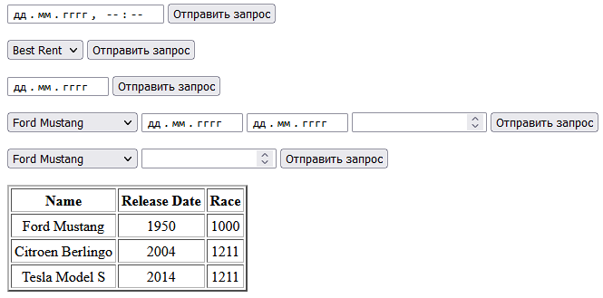

Жукова Анастасія КІУКІ-19-5  Вариант №6

Вариант 6. Импортировать БД для хранения информации о пункте проката машин (Рисунок 5.6).
В базе данных задается название машины, производитель, год выпуска, пробег, состояние, стоимость аренды, время аренды автомобиля.
Сформировать запросы и вывести результаты:

- полученный доход с проката по состоянию на выбранную дату;
- автомобили выбранного производителя;
- свободные автомобили на выбранную дату.

Обеспечить возможность добавления в БД средствами веб-приложения информации об аренде для выбранного автомобиля на указанные даты. Возможность изменения данных о пробеге для выбранного автомобиля.

---

> Полученный доход с проката по состоянию на выбранную дату

---

> Автомобили выбранного производителя

---

> Свободные автомобили на выбранную дату

---

> Данные об аренде для выбранного автомобиля на указанные даты

---

> Изменения данных о пробеге для выбранного автомобиля